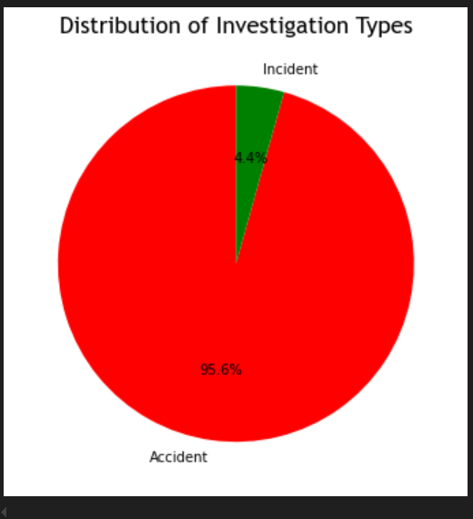

# PHASE 1 PROJECT

 ## AIRCRAFT RISK EVALUATION

 ## OVERVIEW
our company is expanding in to new industries to diversify its portfolio. Specifically, they are interested in purchasing and operating airplanes for commercial and private enterprise  which will be a key step in our growth strategy. To align this expansion with our strategic goals, we will rely on data-driven insights to inform our decisions. A thorough risk assessment will be carried out using aviation accident data spanning from 1993 to 2023. The analysis aims to identify aircraft models and makes with a higher likelihood of severe accidents or operational failures, determine locations that pose higher risks for aircraft operations, and assess the optimal number of engines required for stable and safe flights.
 
 ## BUSINESS UNDERSTANDING
Our company is expanding into the aviation industry, seeking to purchase and operate aircraft for both commercial and private enterprises. To ensure this venture is both safe , we need to assess the risks associated with different aircraft models, operational environments, and structural designs. Specifically, the objectives of this analysis are to:

 1.Identify aircraft models with a higher likelihood of severe accidents or operational failures.

 2.Pinpoint locations that have historically proven risky for aircraft operations, highlighting potential geographic safety concerns.

 3.Determine the number of engines sufficient for ensuring the stability and safety of aircraft operations.

 By achieving these objectives, we will be able to select aircraft models and operational strategies that align with the company’s goals of safety and  reliability minimizing potential risks as we enter this new industry.

## DATA ANALYSIS
The data was analyzed using the VSCode code editor, with essential libraries such as matplotlib and pandas being imported . The analysis focused on columns like Location, Investigation_Type,Number_of_Engines and other columns that were added like Engine_categories, and Accident_Numbers for easier visualization on tableau. Visualizations were created using matplotlib within the ipynb file, while additional visualizations shown below, were developed using Tableau.

##### Graphical representation using a pie chart for the Investigation_Type_column.
The following is a graphical representation using a pie chart to show the proportions of accident and incident investigation types. This visualization offers a clear comparison of the two categories that effectively display proportions, making it straightforward to convey that most investigation types are accidents which takes 95.6% of the investigation type and incidents take 4.4% of the investigation type thereby reducing any potential confusion when interpreting the results.

##### Objective 1:Identify aircraft models and makes with a higher likelihood of  accidents 
This  objective will be addressed using two visualizations for  to identify the number of accidents per make and per model. To be able to achieve this,we grouped and also got the counts the number of accidents based on the Make and Model of the aircraft, then sorted the results in descending order.
   ##### Objective 1.1:Identify aircraft  make with a highest likelihood of  accidents 
The figure below is a graphical representation that shows the aircraft make with the highest number of accidents .

https://public.tableau.com/app/profile/lyster.k/viz/obj1_1/objective1_1?publish=yes

From the figure plotted above it can be clearly seen that the Make with the most accident occurences is Cessna  with 26793 number of accidents  followed by Piper with 14684 number of accidents.

   ##### Objective 1.2 :Identify aircraft  models with the highest likelihood of  accidents 
The figure below is a graphical representation that shows the aircraft models with the highest number of accidents .

https://public.tableau.com/app/profile/lyster.k/viz/obj1_2/objective1_2?publish=yes

From the figure plotted above it can be clearly  that the Model with the most accident occurences is the 152 model with 2348 number of accidents  followed by 172 model with 1744 number of accidents.

##### Objective 2: Pinpoint locations that have historically proven risky for aircraft operations, highlighting potential geographic safety concerns.
The figure below aimed to pinpoint the locations that have historically risky for aircraft operations.This would be visualized by showing the locations with high accident occurrences.

https://public.tableau.com/app/profile/lyster.k/viz/obj2/objective2?publish=yes 

The figure above shows Anchorage being the most risky location for aircraft operations and Orlando and Chicago being among the locations safer for aircraft operations.

##### Objective 3: Determine the number of engines sufficient for ensuring the stability and safety of aircraft operations.
The graphical representation aims to show the number of engines that are sufficient for ensuring stability and safety of aircraft operations. This will be achieved by checking for  count of engines in the  aircraft that had accidents.
 
https://public.tableau.com/app/profile/lyster.k/viz/obj3_17429359971780/objective3?publish=yes

 From the figure we can clearly see that the Aircrafts with more than 4 engines have lesser occurrences of accidents.This could also mean that those aircrafts with less than four engines have a greater probability of accidents.

 ## Conclusions
1.From the graphical representation above we can see that the accidents takes 95.6% of the investigation done while the incidences take 4.4% of the investigation done.

2.The Model with the most accident occurences is the 152 model with 2348 number of accidents  followed by 172 model with 1744 number of accidents.

3.The Make with the most accident occurences is Cessna  with 26793 number of accidents  followed by Piper with 14684 number of accidents.

4.Anchorage is  the most risky location for aircraft operations while Orlando and Chicago are among the locations safer for aircraft operations.

We can see that the aircrafts with more than 4 engines have lesser occurrences of accidents. This would also mean that the aircrafts with less than four engines have a greater probability of accidents. 

## Recommendations
1.Avoid aircraft makes and models that have high accident rates, including brands like Cessna and Piper.

2.Locations with a high risk of accidents should be avoided.This can help airlines to ensure the stability and safety of their aircraft operations.

3.Opting for aircraft with four or more engines, which is considered the optimal number for stable and safe flights, can help minimize the risk of accidents.

#### Tableau link for the dashboard
https://public.tableau.com/app/profile/lyster.k/viz/Vizzes1_17429336070280/Visualizations?publish=yes

